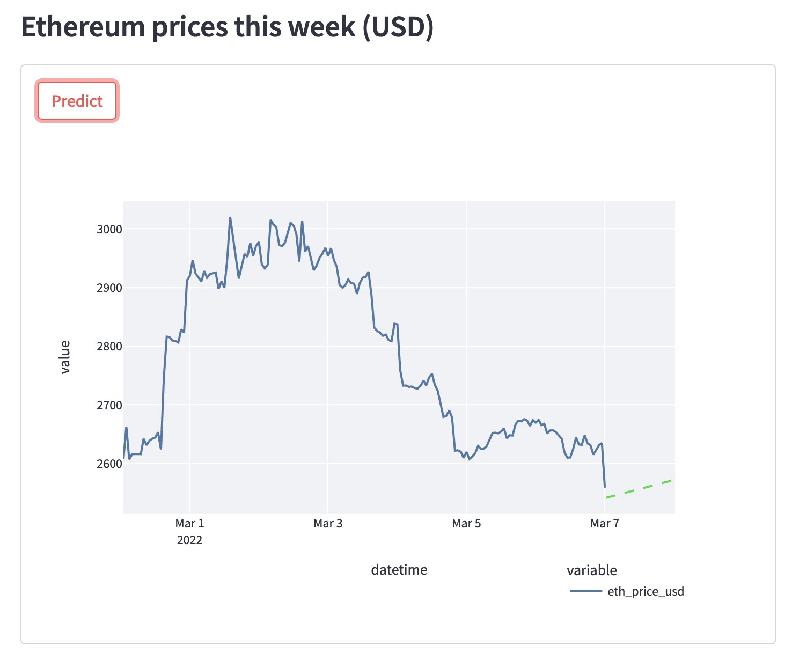
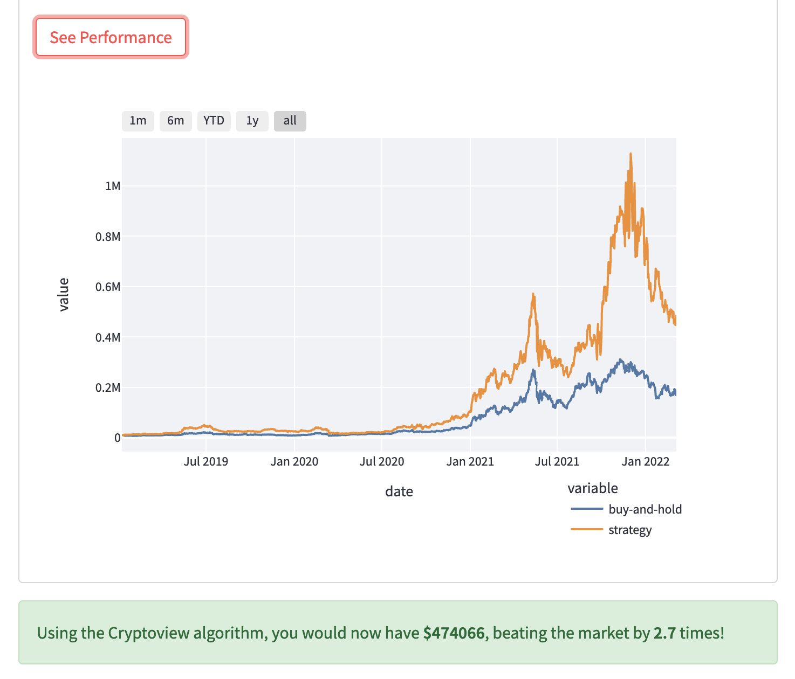

# Marlon Moreira - Ethereum app

---

## Links

- [Demo video](https://www.linkedin.com/posts/marlonmoreira_university-vs-coding-bootcamp-i-made-the-activity-6915502948307390464-0UEz?utm_source=linkedin_share&utm_medium=member_desktop_web)
- [Remote repository](https://github.com/marlonmoreira000/genie-app)

---

## Description

This is a streamlit app that we created at Le Wagon Data Science Bootcamp. First we created an API, then put it in a Docker container and hosted it on Google Cloud. This API contains a Deep Learning Model (LSTM RNN) which is used to predict Ethereum price 24h in advance. It also contains a separate algorithmic-trading strategy which we can backtest in the app.

---

## Purpose

The purpose of this project was to create something fun using some of the technologies we have used in the bootcamp, namely Docker, Cloud hosting, ML/Deep Learning, creating APIs etc.

---

## Functionality / Features

The main features for this app are:

- Ethereum Price Prediction (24h in advance)
- Backtesting our algorithmic trading strategy

---

## App architecture

---

## Screenshots

### 1. Price prediction

### 2. Backtesting

---

## Target Audience

The target audience for this app is anyone is interested in crypto markets and wants to predict Ethereum prices to get an advantage in the market. Also anyone who wants to see the performance of our trading algorithm relative to the market.

---

## Tech stack

To create this app, I used the following technologies:

- Docker
- Google Cloud (for deployment)
- FastAPI
- Scikit Learn / Tensorflow
- Git
- Streamlit
